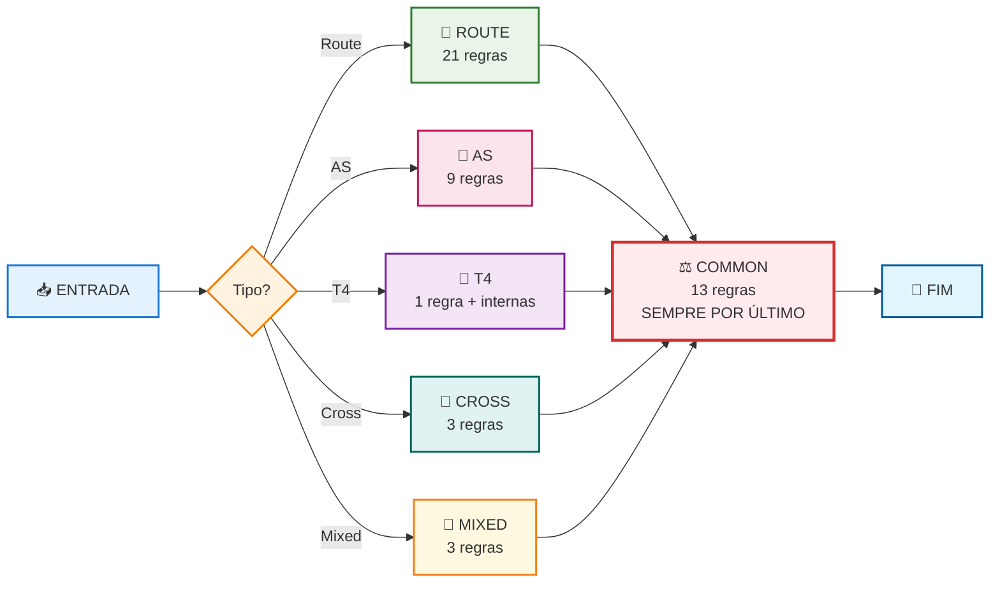
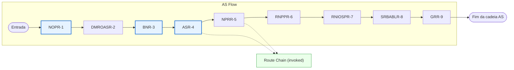
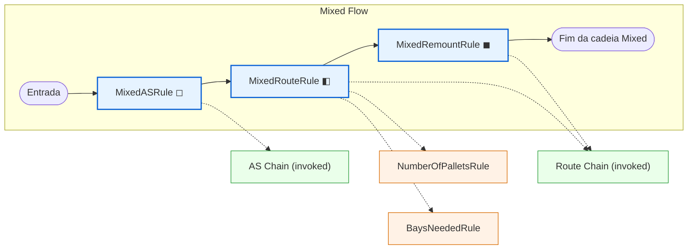
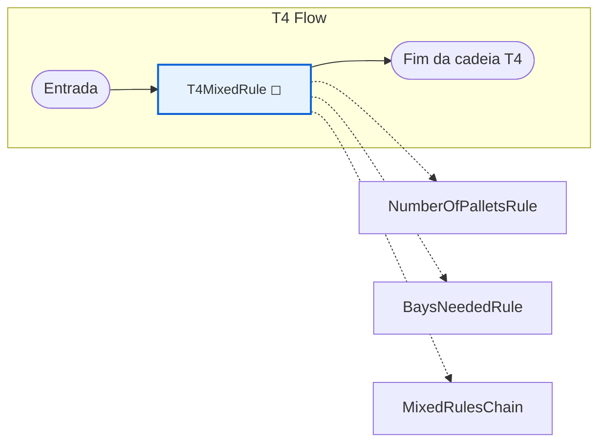
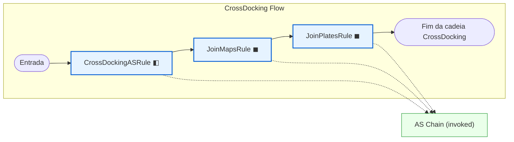

```mermaid
    %% Route flow — alternating top/bottom (sequence left-to-right)
    flowchart LR

    %% Top row: odd-numbered rules (1,3,5,...,19)
    subgraph TopRow["Route"]
        direction LR
        BPR1["BPR-1"]
        BPAOR3["BPAOR-3"]
        PGSGR5["PGSGR-5"]
        SR7["SR-7"]
        RADSR9["RADSR-9"]
        RR11["RR-11"]
        IWWMOR13["IWWMOR-13"]
        ESR15["ESR-15"]
        PR17["PR-17"]
        RPO19["RPO-19"]
    end

    %% Bottom row: even-numbered rules (2,4,6,...,18)
    subgraph BottomRow["Route"]
        direction LR
        CPR2["CPR-2"]
        LR4["LR-4"]
        NPPR6["NPPR-6"]
        NLOLP8["NLOLP-8"]
        RADSRR10["RADSRR-10"]
        IWR12["IWR-12"]
        RSR14["RSR-14"]
        BMSWFDPR16["BMSWFDPR-16"]
        BTR18["BTR-18"]
    end

    %% Sequence connections (zig-zag): Start -> 1 -> 2 -> 3 -> 4 -> ... -> 19 -> End
    Start([Entrada]) --> BPR1
    BPR1 --> CPR2
    CPR2 --> BPAOR3
    BPAOR3 --> LR4
    LR4 --> PGSGR5
    PGSGR5 --> NPPR6
    NPPR6 --> SR7
    SR7 --> NLOLP8
    NLOLP8 --> RADSR9
    RADSR9 --> RADSRR10
    RADSRR10 --> RR11
    RR11 --> IWR12
    IWR12 --> IWWMOR13
    IWWMOR13 --> RSR14
    RSR14 --> ESR15
    ESR15 --> BMSWFDPR16
    BMSWFDPR16 --> PR17
    PR17 --> BTR18
    BTR18 --> RPO19
    RPO19 --> End([Fim da cadeia Route])

    %% Styles
    classDef mandatory fill:#dff0d8,stroke:#2a7,stroke-width:3px,font-size:36px;
    class BPR1,CPR2,BPAOR3,LR4,PGSGR5,NPPR6,SR7,NLOLP8,RADSR9,RADSRR10,RR11,IWR12,IWWMOR13,RSR14,ESR15,BMSWFDPR16,PR17,BTR18,RPO19 mandatory;

```

```mermaid
    %% Common Rules flow — horizontal pools, stacked vertically for clarity
    flowchart LR

    subgraph COMMONTop[Common Rules Flow]
        direction TB

        classDef commonflow fill:#f7f7ff,stroke:#5b5bd6,stroke-width:1.5px,font-size:14px;
        classDef invoked fill:#eaffea,stroke:#2a9d3a,stroke-width:1px,font-size:14px;

        direction LR
        RNPI1["RNPI1-1"]
        JMSWithLessO3["JMSWithLessO3-3"]
        R5["R-5"]
        LB7["LB7-7"]
        SS9["SS-9"]
        VCO11["VCO-11"]
        DU13["VCO-13"]
    end

    subgraph COMMONBottom[Common Rules Flow22]
        direction TB

        classDef commonflow fill:#f7f7ff,stroke:#5b5bd6,stroke-width:1.5px,font-size:14px;
        classDef invoked fill:#eaffea,stroke:#2a9d3a,stroke-width:1px,font-size:14px;

        direction LR
        RNPIWithSplit2["RNPIWithSplit-2"]
        PE4["PE-4"]
        NR6["NR-6"]
        SB8["SB-8"]
        RPO10["RPO-10"]
        CO12["CO-12"]
    end

   %% Sequence connections (zig-zag): Start -> 1 -> 2 -> 3 -> 4 -> ... -> 19 -> End
    Start([Entrada]) --> RNPI1
    RNPI1 --> RNPIWithSplit2
    RNPIWithSplit2 --> JMSWithLessO3
    JMSWithLessO3 --> PE4
    PE4 --> R5
    R5 --> NR6
    NR6 --> LB7
    LB7 --> SB8
    SB8 --> SS9
    SS9 --> RPO10
    RPO10 --> VCO11
    VCO11 --> CO12
    CO12 --> DU13
    DU13 --> End([Fim da cadeia Common])

    class COR1,SSR3,PER5,RNR7,ROR9,DUR11,VCO13 commonflowTop;
    class LBR2,SBR4,RPC6,RNRW8,NRR10,JMSLO12 commonflowBottom;

    %% define Route Chain node and reference it (must be a node id, not a raw string)
    %% Helpers de estilo (opcional/mandatório) mantidos
    classDef commonflowTop fill:#fff8b0,stroke:#c48600,stroke-width:1px;
    classDef commonflowBottom fill:#dff0d8,stroke:#2a7,stroke-width:1px;
    RNPIWithSplit2  -.-> RNPI1

    %% Short legend keys inside comments to keep nodes compact
```

# OCP Score - Sistema de Paletização

## 📋 Visão Geral

Sistema de paletização em Python baseado na arquitetura C# original do WMS StackBuilder. O **CalculatorPalletizingService** é o núcleo central que orquestra todo o processo de paletização, gerenciando arquivos de configuração, dados de entrada e execução de regras de negócio.

## 🎯 Objetivo

Migrar e implementar o sistema de paletização do C# para Python, mantendo a lógica original com melhorias em:
- ✅ **Gerenciamento centralizado** via CalculatorPalletizingService
- ✅ **Configuração flexível** através de arquivos JSON
- ✅ **Execução de regras em cadeia** (Rule Chain Pattern)
- ✅ **Compatibilidade total** com dados do sistema C# original


# 📋 Sequência de Execução das Regras - Stack Builder

## 🎯 **Fluxograma Simples - Ordem de Execução**



---

## 📋 **Divisão por Tipo de Operação**

### 🚚 **RouteRules (21 regras)**
**Cadeia Básica (2 regras):**
- **ComplexGroupLoadRule** *(primeira)* — Agrupa cargas complexas por cliente/rota e tenta montar cargas compostas.
- **FilteredRouteRule** — Aplica filtros de rota e pré-valida espaços antes da cadeia principal.

**Cadeia Principal (19 regras):**
- **BulkPalletRule** *(primeira da cadeia principal)* — Preenche paletes inteiros priorizando produtos que cabem em pallet completo.
- **ChoppPalletizationRule** — Regras específicas para paletização de chopp/kegs (agrupamento e restrições).
- **BulkPalletAdditionalOccupationRule** — Ajusta ocupação adicional em paletes bulk para otimizar uso de espaço.
- **LayerRule** — Organiza produtos em camadas no palete respeitando alturas e limites.
- **PalletGroupSubGroupRule** — Agrupa produtos por grupo/subgrupo para manter compatibilidade de carga.
- **NonPalletizedProductsRule** — Aloca itens não-paletizados em paletes/espaços compatíveis.
- **SnapshotRule** — Cria um snapshot do contexto para execuções conservadoras e comparações entre estratégias.
- **NonLayerOnLayerPalletRule** — Tenta inserir itens não-camada em paletes que já têm camadas quando compatível.
- **ReturnableAndDisposableSplitRule** — Separa/redistribui produtos entre embalagens retornáveis e descartáveis.
- **ReturnableAndDisposableSplitRemountRule** — Variante focada em remontes, reorganizando itens em paletes retornáveis/descartáveis.
- **RemountRule** — Orquestra a lógica de remontagem geral (invoca regras de não-paletizados e remounts).
- **IsotonicWaterRule** — Garante alocação correta de água/isotônicos, validando ocupação mínima do palete.
- **IsotonicWaterWithoutMinimumOccupationRule** — Versão sem validação de ocupação mínima (mais permissiva).
- **RemountSplittedRebuildPalletRule** — Reconstrói paletes quebrados (splitted) usando snapshot e regras de remount.
- **EmptySpaceRule** — Preenche espaços vazios remanescentes com produtos compatíveis para melhorar aproveitamento.
- **BuildMountedSpacesWithFewDisposableProductsRule** — Cria montagens com poucos descartáveis para otimizar paletização.
- **PackagesRule** — Aloca produtos por caixas completas (pacotes) quando aplicável.
- **BoxTemplateRule** — Aplica templates de caixas para definir empacotamento padrão por produto.
- **RecalculatePalletOccupationRule** *(última)* — Recalcula ocupações de paletes após mudanças para manter consistência.




### 🎪 **ASRules (9 regras)**
 - **NumberOfPalletsRule** *(primeira)* — Calcula a quantidade de paletes necessária para um conjunto de pedidos.
 - **DistributeMixedRouteOnASRule** — Distribui cargas mistas entre baias AS respeitando limites e compatibilidade.
 - **BaysNeededRule** — Determina quantas baias são necessárias para montar a carga planejada.
 - **ASRouteRule** — Orquestra a montagem de mapas no modo AS (conjunto de regras específicas de AS).
 - **NonPalletizedRouteRule** — Trata itens não-paletizados no fluxo AS (alocação e regras específicas).
 - **RecalculateNonPalletizedProductsRule** — Recalcula ocupações/quantidades de itens não-paletizados após mudanças.
 - **ReallocateNonPalletizedItemsOnSmallerPalletRule** — Realoca itens não-paletizados para paletes menores quando necessário.
 - **SeparateRemountBaysAndLayerBaysRule** — Separa baias de remontagem e baias destinadas a camadas para evitar conflito.
 - **GroupReorderRule** *(última)* — Etapa final de reagrupamento/ordenamento para otimizar sequência de montagem.




### 🔄 **CrossDockingRules (3 regras)**
 - **CrossDockingASRule** *(primeira)* — Coordena o fluxo de cross-docking e invoca a cadeia AS quando necessário.
 - **JoinMapsRule** — Realiza a fusão/ajuste entre mapas de rota durante o cross-docking.
 - **JoinPlatesRule** *(última)* — Consolida paletes/placas entre mapas para manter continuidade no cross-docking.


### 🔀 **MixedRules (3 regras)**
 - **MixedASRule** *(primeira)* — Integra lógica AS em cenários mistos para montar cargas combinadas.
 - **MixedRouteRule** — Executa estratégias de mistura de rotas, priorizando compatibilidade entre SKUs.
 - **MixedRemountRule** *(última)* — Garante remontagens corretas em mapas mistos quando necessário.



 

### 🎯 **T4Rules (1 regra + chamadas internas)**
 - **T4MixedRule** *(única)* — Orquestra o fluxo T4 (variante especial), invocando regras de contagem e mistura quando aplicável.
  - Chama internamente: **NumberOfPalletsRule**, **BaysNeededRule**, **MixedRulesChain**




### ⚖️ **CommonRules (13 regras) - SEMPRE POR ÚLTIMO**
 - **ReassignmentNonPalletizedItemsRule** *(primeira)* — Reatribui itens não-paletizados entre espaços para melhorar encaixe.
 - **ReassignmentNonPalletizedItemsWithSplitItemRule** — Reatribuição considerando itens que já foram divididos entre paletes.
 - **JoinMountedSpacesWithLessOccupationRule** — Junta espaços montados com baixa ocupação para otimizar uso.
 - **PalletEqualizationRule** — Equaliza ocupação entre paletes para balancear cargas.
 - **ReorderRule** — Reordena itens/paletes para atender restrições operacionais.
 - **NewReoderRule** — Nova estratégia de reorder/otimização (variante atualizada).
 - **LoadBalancerRule** — Balanceia distribuição de carga entre baias e lados.
 - **SideBalanceRule** — Assegura balanceamento lateral dos paletes (lado esquerdo/direito).
 - **SafeSideRule** — Impõe regras de segurança de empilhamento e distribuição lateral.
 - **RecalculatePalletOccupationRule** — Recalcula ocupações após alterações (consistência final).
 - **VehicleCapacityOverflowRule** — Evita ultrapassar capacidade do veículo/rota.
 - **CalculatorOccupationRule** — Fornece utilitários/calculadoras de ocupação usados por regras.
 - **DetachedUnitRule** *(última absoluta)* — Manipula unidades destacadas; etapa final de ajuste/limpeza.



## 📊 **Resumo**

| Tipo | Total Regras | Primeira Regra | Última Regra |
|------|-------------|----------------|--------------|
| Route | 21 | ComplexGroupLoadRule | RecalculatePalletOccupationRule |
| AS | 9 | NumberOfPalletsRule | GroupReorderRule |
| T4 | 1 | T4MixedRule | T4MixedRule |
| CrossDocking | 3 | CrossDockingASRule | JoinPlatesRule |
| Mixed | 3 | MixedASRule | MixedRemountRule |
| **Common** | **13** | **ReassignmentNonPalletizedItemsRule** | **DetachedUnitRule** |

**🎯 Total: 48 regras únicas**

**⚡ Regra importante**: CommonRules sempre executa por último, independente do tipo de operação.

---

**Como iniciar o sistema (Windows)**

Siga estes passos para criar o ambiente virtual, instalar dependências e executar a API localmente.

1) Criar o ambiente virtual (na raiz do repositório `wms_ocp`):

```powershell
python -m venv .venv
```

2) Ativar o ambiente virtual

- PowerShell (recomendado):

```powershell
.\.venv\Scripts\Activate.ps1
```

- CMD.exe (alternativa):

```cmd
.venv\Scripts\activate.bat
```

3) Atualizar o pip (opcional, recomendado):

```powershell
python -m pip install --upgrade pip
```

4) Instalar dependências do projeto:

```powershell
pip install -r requirements.txt
```

5) Executar a API com `uvicorn` (a partir da raiz do workspace):

```powershell
uvicorn wms_ocp.api.main:app --reload
```

Observações rápidas:
- Execute os comandos a partir da pasta raiz do repositório (onde está o `requirements.txt`).
- O `--reload` reinicia o servidor automaticamente sempre que houver mudanças no código (útil em desenvolvimento).
- Se preferir, use o `.venv` criado para debugar no VSCode configurando o Python interpreter para `.venv\Scripts\python.exe`.

# OCP Score - Sistema de Paletização

## 📋 Visão Geral

Sistema de paletização em Python baseado na arquitetura C# original do WMS StackBuilder. O **CalculatorPalletizingService** é o núcleo central que orquestra todo o processo de paletização, gerenciando arquivos de configuração, dados de entrada e execução de regras de negócio.

## 🎯 Objetivo

Migrar e implementar o sistema de paletização do C# para Python, mantendo a lógica original com melhorias em:
- ✅ **Gerenciamento centralizado** via CalculatorPalletizingService
- ✅ **Configuração flexível** através de arquivos JSON
- ✅ **Execução de regras em cadeia** (Rule Chain Pattern)
- ✅ **Compatibilidade total** com dados do sistema C# original


# 📋 Sequência de Execução das Regras - Stack Builder

## 🎯 **Fluxograma Simples - Ordem de Execução**


---

## 📋 **Divisão por Tipo de Operação**

### 🚚 **RouteRules (21 regras)**
**Cadeia Básica (2 regras):**
- **ComplexGroupLoadRule** *(primeira)* — Agrupa cargas complexas por cliente/rota e tenta montar cargas compostas.
- **FilteredRouteRule** — Aplica filtros de rota e pré-valida espaços antes da cadeia principal.

**Cadeia Principal (19 regras):**
- **BulkPalletRule** *(primeira da cadeia principal)* — Preenche paletes inteiros priorizando produtos que cabem em pallet completo.
- **ChoppPalletizationRule** — Regras específicas para paletização de chopp/kegs (agrupamento e restrições).
- **BulkPalletAdditionalOccupationRule** — Ajusta ocupação adicional em paletes bulk para otimizar uso de espaço.
- **LayerRule** — Organiza produtos em camadas no palete respeitando alturas e limites.
- **PalletGroupSubGroupRule** — Agrupa produtos por grupo/subgrupo para manter compatibilidade de carga.
- **NonPalletizedProductsRule** — Aloca itens não-paletizados em paletes/espaços compatíveis.
- **SnapshotRule** — Cria um snapshot do contexto para execuções conservadoras e comparações entre estratégias.
- **NonLayerOnLayerPalletRule** — Tenta inserir itens não-camada em paletes que já têm camadas quando compatível.
- **ReturnableAndDisposableSplitRule** — Separa/redistribui produtos entre embalagens retornáveis e descartáveis.
- **ReturnableAndDisposableSplitRemountRule** — Variante focada em remontes, reorganizando itens em paletes retornáveis/descartáveis.
- **RemountRule** — Orquestra a lógica de remontagem geral (invoca regras de não-paletizados e remounts).
- **IsotonicWaterRule** — Garante alocação correta de água/isotônicos, validando ocupação mínima do palete.
- **IsotonicWaterWithoutMinimumOccupationRule** — Versão sem validação de ocupação mínima (mais permissiva).
- **RemountSplittedRebuildPalletRule** — Reconstrói paletes quebrados (splitted) usando snapshot e regras de remount.
- **EmptySpaceRule** — Preenche espaços vazios remanescentes com produtos compatíveis para melhorar aproveitamento.
- **BuildMountedSpacesWithFewDisposableProductsRule** — Cria montagens com poucos descartáveis para otimizar paletização.
- **PackagesRule** — Aloca produtos por caixas completas (pacotes) quando aplicável.
- **BoxTemplateRule** — Aplica templates de caixas para definir empacotamento padrão por produto.
- **RecalculatePalletOccupationRule** *(última)* — Recalcula ocupações de paletes após mudanças para manter consistência.


### 🎪 **ASRules (9 regras)**
 - **NumberOfPalletsRule** *(primeira)* — Calcula a quantidade de paletes necessária para um conjunto de pedidos.
 - **DistributeMixedRouteOnASRule** — Distribui cargas mistas entre baias AS respeitando limites e compatibilidade.
 - **BaysNeededRule** — Determina quantas baias são necessárias para montar a carga planejada.
 - **ASRouteRule** — Orquestra a montagem de mapas no modo AS (conjunto de regras específicas de AS).
 - **NonPalletizedRouteRule** — Trata itens não-paletizados no fluxo AS (alocação e regras específicas).
 - **RecalculateNonPalletizedProductsRule** — Recalcula ocupações/quantidades de itens não-paletizados após mudanças.
 - **ReallocateNonPalletizedItemsOnSmallerPalletRule** — Realoca itens não-paletizados para paletes menores quando necessário.
 - **SeparateRemountBaysAndLayerBaysRule** — Separa baias de remontagem e baias destinadas a camadas para evitar conflito.
 - **GroupReorderRule** *(última)* — Etapa final de reagrupamento/ordenamento para otimizar sequência de montagem.


### 🔄 **CrossDockingRules (3 regras)**
 - **CrossDockingASRule** *(primeira)* — Coordena o fluxo de cross-docking e invoca a cadeia AS quando necessário.
 - **JoinMapsRule** — Realiza a fusão/ajuste entre mapas de rota durante o cross-docking.
 - **JoinPlatesRule** *(última)* — Consolida paletes/placas entre mapas para manter continuidade no cross-docking.



### 🔀 **MixedRules (3 regras)**
 - **MixedASRule** *(primeira)* — Integra lógica AS em cenários mistos para montar cargas combinadas.
 - **MixedRouteRule** — Executa estratégias de mistura de rotas, priorizando compatibilidade entre SKUs.
 - **MixedRemountRule** *(última)* — Garante remontagens corretas em mapas mistos quando necessário.


 

### 🎯 **T4Rules (1 regra + chamadas internas)**
 - **T4MixedRule** *(única)* — Orquestra o fluxo T4 (variante especial), invocando regras de contagem e mistura quando aplicável.
  - Chama internamente: **NumberOfPalletsRule**, **BaysNeededRule**, **MixedRulesChain**


### ⚖️ **CommonRules (13 regras) - SEMPRE POR ÚLTIMO**
 - **ReassignmentNonPalletizedItemsRule** *(primeira)* — Reatribui itens não-paletizados entre espaços para melhorar encaixe.
 - **ReassignmentNonPalletizedItemsWithSplitItemRule** — Reatribuição considerando itens que já foram divididos entre paletes.
 - **JoinMountedSpacesWithLessOccupationRule** — Junta espaços montados com baixa ocupação para otimizar uso.
 - **PalletEqualizationRule** — Equaliza ocupação entre paletes para balancear cargas.
 - **ReorderRule** — Reordena itens/paletes para atender restrições operacionais.
 - **NewReoderRule** — Nova estratégia de reorder/otimização (variante atualizada).
 - **LoadBalancerRule** — Balanceia distribuição de carga entre baias e lados.
 - **SideBalanceRule** — Assegura balanceamento lateral dos paletes (lado esquerdo/direito).
 - **SafeSideRule** — Impõe regras de segurança de empilhamento e distribuição lateral.
 - **RecalculatePalletOccupationRule** — Recalcula ocupações após alterações (consistência final).
 - **VehicleCapacityOverflowRule** — Evita ultrapassar capacidade do veículo/rota.
 - **CalculatorOccupationRule** — Fornece utilitários/calculadoras de ocupação usados por regras.
 - **DetachedUnitRule** *(última absoluta)* — Manipula unidades destacadas; etapa final de ajuste/limpeza.


## 📊 **Resumo**

| Tipo | Total Regras | Primeira Regra | Última Regra |
|------|-------------|----------------|--------------|
| Route | 21 | ComplexGroupLoadRule | RecalculatePalletOccupationRule |
| AS | 9 | NumberOfPalletsRule | GroupReorderRule |
| T4 | 1 | T4MixedRule | T4MixedRule |
| CrossDocking | 3 | CrossDockingASRule | JoinPlatesRule |
| Mixed | 3 | MixedASRule | MixedRemountRule |
| **Common** | **13** | **ReassignmentNonPalletizedItemsRule** | **DetachedUnitRule** |

**🎯 Total: 48 regras únicas**

**⚡ Regra importante**: CommonRules sempre executa por último, independente do tipo de operação.

